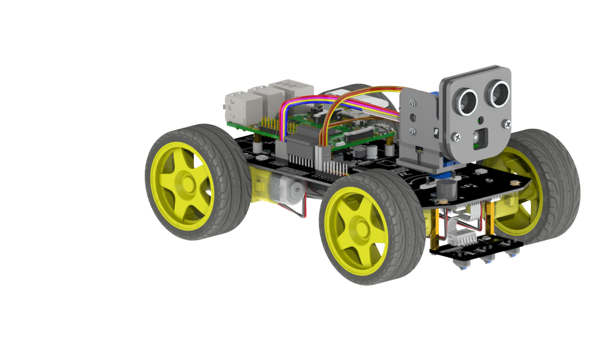

## Freenove 4WD Smart Car Kit for Raspberry Pi

> A 4WD smart car kit for Raspberry Pi.

> AI Code Academy has appended this repository for the "Machine Learning with Raspberry Pi Smart Car" course. The original Freenove project files are still present, and the course-specific lesson code lives in `Code/User`.



### Download

- **Use command in console**

  Run the following command to download this course repository.

  `git clone https://github.com/renashall/smartcar2026.git`

- **Manually download in browser**

  Click the green "Clone or download" button, then click "Download ZIP" button in the pop-up window.
  Do NOT click the "Open in Desktop" button, it will lead you to install Github software.

> This repository is based on Freenove's original smart car kit files, with
> AI Code Academy course material added on top.

### Computer (laptop / desktop) Setup

Lessons that only watch the camera or run the GUI (Lesson 6 client, 7, 8, 11) run on a regular Windows, macOS, or Linux computer. To set one up, run the cross-platform helper from the project root with your system Python:

```sh
# Windows
python Code\setup.py

# macOS / Linux
python3 Code/setup.py
```

`Code/setup.py` detects your operating system, creates a virtual environment named `.venv` in the project root, and installs the Python packages from `requirements.txt` into it. **No administrator or `sudo` is needed** — it only writes a `.venv` folder inside the project. If the virtual environment already exists it is reused; pass `--force` to rebuild it. If anything fails, the script prints the exact commands to finish by hand.

When it finishes, activate the environment before running a lesson:

```powershell
# Windows (PowerShell)
.\.venv\Scripts\Activate.ps1
python Code\User\lesson_7_face_tracking.py <PI_IP>
```

If PowerShell blocks the activation script, allow it once for your user and try again:

```powershell
Set-ExecutionPolicy -Scope CurrentUser -ExecutionPolicy RemoteSigned
```

```sh
# macOS / Linux
source .venv/bin/activate
python3 Code/User/lesson_7_face_tracking.py <PI_IP>
```

Run `deactivate` to leave the virtual environment when you are done.

### Raspberry Pi Setup

The Raspberry Pi needs system packages (camera, GPIO, the LED driver) that a `.venv` would hide, so on the Pi use the two setup scripts in the `Code` folder instead of `Code/setup.py`. After downloading this repository on your Raspberry Pi, open a terminal in the project folder and run them in order.

```sh
cd smartcar2026/Code
chmod +x setupPart1.sh setupPart2.sh
./setupPart1.sh
```

`setupPart1.sh` enables the required Raspberry Pi interfaces, makes `python3` the default `python`, installs basic I2C support, and applies the Bullseye patch where needed. It auto-detects your Raspberry Pi model and OS, then prompts you to reboot.

After the Raspberry Pi reboots, return to the `Code` folder and run the second setup script:

```sh
cd smartcar2026/Code
./setupPart2.sh
```

`setupPart2.sh` updates the Raspberry Pi boot configuration for the camera, applies the audio workaround needed by older Raspberry Pi models, installs the addressable-LED (WS281x) driver and the course Python packages, and then prompts you to reboot again.

### Where to Put Your Code

Create your own course and experiment files in:

```text
smartcar2026/Code/User
```

This keeps your work separate from the Freenove `Code/Server` and `Code/Client` files.
The private course branch includes the example smart car user-code files for this folder; the public branch may only include the shared setup helper and notes.

When a script in `Code/User` needs to import the car modules, put this line at the top of the script before other car imports:

```python
import car_setup
```

Then import the car code normally. For example:

```python
import car_setup

from Motor import Motor
from Led import Led
from Command import COMMAND
```

`Code/User/car_setup.py` adds the project `Code/Server` and `Code/Client` folders to Python's import path. Keep `car_setup.py` in `Code/User`; you do not need to copy it into each lesson file.

To run one of your scripts from the Raspberry Pi, open a terminal in the `Code/User` folder and run it with Python 3:

```sh
cd smartcar2026/Code/User
python3 your_script.py
```

### Support

Freenove provides free and quick customer support. Including but not limited to:

- Quality problems of products
- Using Problems of products
- Questions of learning and creation
- Opinions and suggestions
- Ideas and thoughts

Please send an email to:

[support@freenove.com](mailto:support@freenove.com)

We will reply to you within one working day.

### Purchase

Please visit the following page to purchase our products:

http://store.freenove.com

Business customers please contact us through the following email address:

[sale@freenove.com](mailto:sale@freenove.com)

### Copyright

All the files in this repository are released under [Creative Commons Attribution-NonCommercial-ShareAlike 3.0 Unported License](http://creativecommons.org/licenses/by-nc-sa/3.0/).


This means you can use them on your own derived works, in part or completely. But NOT for the purpose of commercial use.
You can find a copy of the license in this repository.

Freenove brand and logo are copyright of Freenove Creative Technology Co., Ltd. Can't be used without formal permission.

### About

Freenove is an open-source electronics platform.

Freenove is committed to helping customer quickly realize the creative idea and product prototypes, making it easy to get started for enthusiasts of programing and electronics and launching innovative open source products.

Our services include:

- Robot kits
- Learning kits for Arduino, Raspberry Pi and micro:bit
- Electronic components and modules, tools
- Product customization service

Our code and circuit are open source. You can obtain the details and the latest information through visiting the following web site:

http://www.freenove.com
